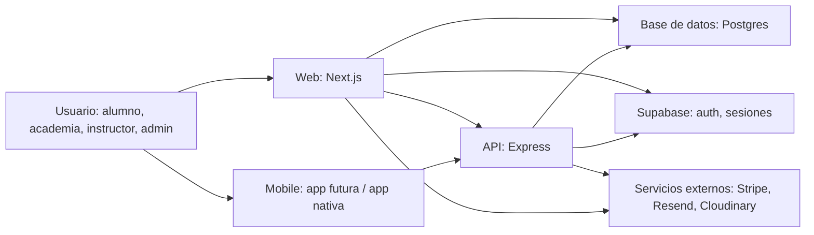
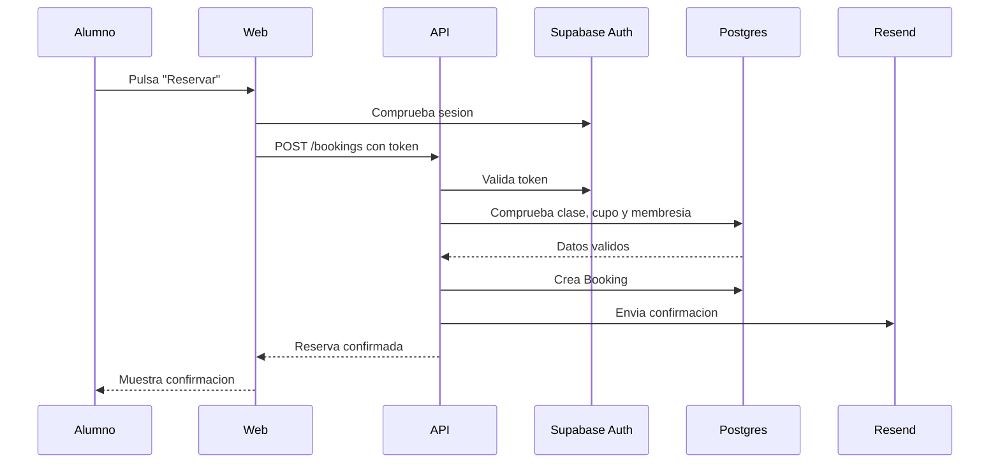

# Guia arquitectonica de Martial V2

Una plataforma digital se parece a un cuerpo vivo: tiene cara, memoria,
sistema nervioso, circulacion, defensas y una forma de crecer sin romperse.
Esta guia explica Martial V2 desde esa idea, pero usando los nombres reales
que aparecen en el codigo para que puedas hablar con desarrolladores,
decidir prioridades y entender que ocurre desde que alguien pulsa un boton
hasta que la plataforma esta publicada en internet.

## 1. El mapa del cuerpo



En este repositorio, Martial V2 esta organizado como un monorepo. Eso significa
que varias aplicaciones viven en una sola casa:

- `apps/web`: la web principal hecha con Next.js.
- `apps/api`: una API Express para endpoints internos y logica de servidor.
- `apps/mobile`: espacio para la app movil.
- `apps/prototype`: prototipos rapidos.
- `packages/ui`: componentes visuales compartidos.
- `packages/types`: tipos compartidos entre aplicaciones.
- `prisma/schema.prisma`: el mapa central de la base de datos.

El comando principal que coordina todo es Turborepo:

```sh
npm run dev
npm run build
npm run lint
npm run check-types
```

## 2. La cara: frontend web

La cara es lo que ve la persona usuaria: paginas, botones, paneles, mapas,
formularios y dashboards.

En Martial V2 esa cara vive en `apps/web` y usa:

- Next.js: framework principal de la web.
- React: componentes interactivos.
- Tailwind CSS: estilos visuales.
- Supabase SSR: sesiones y autenticacion en servidor.
- Prisma: acceso a datos desde algunas zonas server-side.

Ejemplos de zonas visibles:

- Landing y discovery: `app/page.tsx`, `components/HeroSection.tsx`,
  `components/HomeDiscovery.tsx`.
- Exploracion de academias: `app/explore/page.tsx`, `components/ExploreMap.tsx`.
- Login y registro: `app/login/page.tsx`, `app/register/page.tsx`.
- Dashboard: `app/dashboard`.
- Admin: `app/admin`.

Cuando alguien entra en la web, Next.js decide que pagina cargar, busca datos
si hace falta, renderiza HTML y despues React activa la interaccion en el
navegador.

## 3. El sistema nervioso: API

La API es el sistema nervioso. Recibe peticiones, valida quien eres, ejecuta
logica y responde.

En este proyecto vive en `apps/api` y usa:

- Express: servidor HTTP.
- Prisma: comunicacion con Postgres.
- Supabase: validacion de tokens de usuario.
- CORS y JSON: para aceptar peticiones desde la web.

Ejemplos actuales:

- `GET /health`: comprueba que la API esta viva.
- `GET /me`: obtiene o crea el usuario autenticado.
- `GET /db-test`: prueba temporal de conexion con la base de datos.

En una plataforma mas madura, aqui vivirian endpoints como:

- Crear o editar academia.
- Reservar clase.
- Confirmar asistencia.
- Gestionar pagos.
- Invitar alumnos.
- Enviar emails.
- Sincronizar contenido.

## 4. La memoria: base de datos

La base de datos es la memoria a largo plazo. Guarda usuarios, academias,
clases, reservas, membresias, pagos, afiliaciones y contenido.

En Martial V2 el modelo esta definido en:

```txt
prisma/schema.prisma
```

La tecnologia prevista es:

- Postgres: base de datos relacional.
- Prisma: capa que traduce TypeScript a consultas SQL seguras.
- Supabase: hosting y herramientas alrededor de Postgres.

Algunas entidades importantes del schema:

- `User`: persona dentro del sistema.
- `School`: academia.
- `SchoolMember`: relacion entre usuario y academia.
- `Booking`: reserva de clase.
- `MembershipPlan`: plan o tarifa.
- `Transaction`: ingresos y gastos.
- `Affiliation`: organizacion tipo Roger Gracie Association.
- `ContentPlatform`, `ContentSeries`, `ContentVideo`: contenido tipo TV o
  biblioteca de videos.

La diferencia importante:

- Postgres guarda los datos.
- Prisma define el modelo y permite consultarlo desde codigo.
- Supabase puede encargarse de auth, panel de DB y servicios de backend.

## 5. Los estados de negocio: el ciclo vital

Ademas de guardar datos, Martial V2 necesita entender en que momento de su vida
esta cada academia, lead, claim o relacion. Esta capa conecta la arquitectura
con el negocio real: imports, invitaciones, onboarding, verificacion y
activacion.

Un flujo comercial razonable para academias es:

```txt
lead -> contacted -> invited -> claimed/onboarding -> verified -> active
```

Ese flujo cuenta la historia desde que Martial descubre una academia hasta que
esa academia esta operando dentro de la plataforma.

Tambien existen estados mas administrativos:

```txt
unverified
verified
partner
inactive
rejected
```

En el schema actual ya aparecen varias piezas relacionadas:

- `SchoolStatus`: estado de una academia.
- `SchoolSource`: origen de la academia, por ejemplo importada, manual o
  autorregistrada.
- `LeadStage`: etapa comercial u operativa del lead.
- `ClaimStatus`: estado de una solicitud para reclamar una academia.
- `SchoolMemberStatus`: estado de una persona dentro de una academia.

El punto clave: una academia no es solo una fila en la base de datos. Es una
entidad que pasa por fases:

1. Se importa o se crea.
2. Se contacta.
3. Se invita a su owner.
4. El owner reclama la academia.
5. Martial revisa o aprueba.
6. La academia completa onboarding.
7. La academia queda verificada o activa.

Esto permite separar bien marketplace y operaciones:

- Marketplace: academias visibles, perfiles publicos, busqueda y leads.
- SaaS: academias activas con dashboard, alumnos, reservas, pagos y gestion.

## 6. La identidad: auth, ownership y permisos

La identidad responde a tres preguntas:

- Quien eres.
- Que rol tienes.
- Que puedes hacer.

El proyecto ya contempla roles como:

- `SUPERADMIN`: control global de la plataforma.
- `SCHOOL_OWNER`: propietario de academia.
- `INSTRUCTOR`: profesor.
- `STUDENT`: alumno.

Supabase Auth identifica a la persona y emite un token. La API valida ese token.
Despues Martial V2 usa su propia base de datos para saber que relacion tiene
esa persona con academias, membresias y permisos.

La regla mas importante: los permisos no dependen solo del rol global. Dependen
de la relacion con una academia concreta, normalmente mediante `SchoolMember`.

Ejemplos:

- Un instructor puede gestionar clases de su academia, pero no de otra.
- Un owner puede editar su academia, pero no aprobar claims globales.
- Un alumno puede reservar clases donde tiene acceso, pero no ver gestion
  financiera.
- Un superadmin puede validar academias, claims, imports y moderacion global.

Por eso una comprobacion sana de permisos suele preguntar:

```txt
Quien eres?
Que rol global tienes?
A que academia pertenece esta accion?
Que relacion tienes con esa academia?
Esta academia esta en un estado que permite esta accion?
```

Ejemplo de viaje:

1. El usuario hace login.
2. Supabase confirma la identidad.
3. La web guarda una sesion segura.
4. La API recibe un JWT cuando se llama a rutas protegidas.
5. Martial V2 consulta `User`, `SchoolMember` y permisos internos.
6. La accion se permite o se bloquea.

## 7. La circulacion: datos viajando por la plataforma

Ejemplo: un alumno reserva una clase.



En lenguaje simple: el boton no "reserva" por si solo. El boton inicia una
cadena de validaciones, escrituras y respuestas.

## 8. Hosting: donde vive cada organo

Hosting significa "donde se ejecuta esto cuando ya no esta en tu ordenador".

Una arquitectura razonable para Martial V2 seria:

- Web Next.js: Vercel.
- API Express: Render, Railway, Fly.io, Heroku o un servicio Node en la nube.
- Base de datos Postgres: Supabase.
- Auth: Supabase.
- Emails: Resend.
- Pagos: Stripe.
- Imagenes: Cloudinary.
- Dominio: proveedor tipo Cloudflare, Namecheap o similar.
- DNS/CDN: Cloudflare o Vercel.

Version simple para empezar:

```txt
Usuario -> Dominio -> Vercel Web -> Supabase/Postgres
                         |
                         -> API Node -> Supabase/Postgres
```

Version mas avanzada:

```txt
Usuario
  -> CDN / DNS
  -> Web Next.js
  -> API
  -> Cola de trabajos
  -> Base de datos
  -> Servicios externos
  -> Observabilidad
```

## 9. Compilar, construir, desplegar

Estos terminos suelen mezclarse, pero no son lo mismo.

### Desarrollar

Trabajar en local, con servidores vivos que se actualizan al guardar.

```sh
npm run dev
```

### Compilar

Traducir TypeScript y frameworks a codigo listo para ejecutarse. Tambien detecta
errores de tipos o imports rotos.

En este proyecto:

```sh
npm run build
```

Turborepo ejecuta `build` en las apps y paquetes. En `apps/web`, antes de
construir Next.js, se ejecuta:

```sh
prisma generate --schema=../../prisma/schema.prisma
```

Eso genera el cliente de Prisma para que el codigo pueda hablar con la base de
datos usando tipos.

### Testear

Comprobar comportamientos automaticamente.

```sh
npm run lint
npm run check-types
npm test --workspace web
```

### Deploy

Publicar una version en internet. Normalmente el proveedor hace:

1. Descarga el codigo desde GitHub.
2. Instala dependencias.
3. Lee variables de entorno.
4. Compila.
5. Arranca o publica la app.
6. Enruta trafico desde el dominio.

### Release

Una version concreta de producto que ya se considera entregada. Puede incluir
notas, tag de Git, migraciones de DB y comunicacion al equipo.

## 10. Variables de entorno: las hormonas del sistema

Las variables de entorno son configuracion secreta o dependiente del entorno.
No viven dentro del codigo porque cambian entre local, staging y produccion.

Ejemplos de este proyecto:

- `DATABASE_URL`: conexion a Postgres.
- `DIRECT_URL`: conexion directa para migraciones.
- `NEXT_PUBLIC_SUPABASE_URL`: URL publica de Supabase.
- `NEXT_PUBLIC_SUPABASE_PUBLISHABLE_KEY`: clave publica de Supabase.
- `SUPABASE_SECRET_KEY`: clave privada de servidor.
- `API_URL`: API interna.
- `NEXT_PUBLIC_API_URL`: API visible desde la web.
- `STRIPE_SECRET_KEY`: clave privada de pagos.
- `RESEND_API_KEY`: clave para emails.
- `CLOUDINARY_*`: claves para imagenes.

Regla de oro: nunca subir `.env` a GitHub.

## 11. Migraciones: cuando cambia la memoria

Una migracion es un cambio controlado en la estructura de la base de datos.

Ejemplos:

- Anadir una columna `phone` a `User`.
- Crear tabla `Booking`.
- Cambiar un enum de estados.
- Crear indice para busquedas rapidas.

El flujo tipico con Prisma:

```sh
npx prisma migrate dev
npx prisma generate
```

En produccion:

```sh
npx prisma migrate deploy
```

El punto clave: cambiar el schema no basta. Hay que aplicar el cambio a la base
de datos real.

## 12. Monorepo: una ciudad dentro de una misma muralla

El monorepo permite que web, API, mobile y paquetes compartidos vivan juntos.

Ventajas:

- Tipos compartidos.
- Componentes compartidos.
- Un solo sitio para comandos.
- Cambios coordinados entre frontend y backend.
- Mejor cache con Turborepo.

Riesgos:

- Puede crecer sin orden si no se separan responsabilidades.
- Las variables de entorno deben estar bien documentadas.
- Hay que cuidar dependencias entre paquetes.

Para Martial V2, el monorepo tiene sentido porque la plataforma tendra varias
caras: web publica, dashboard, API, app movil y posiblemente herramientas
internas.

## 13. Ambientes: local, staging, produccion

Una plataforma sana suele tener tres mundos:

- Local: tu ordenador. Sirve para desarrollar.
- Staging: copia casi real. Sirve para probar antes de publicar.
- Produccion: lo que usan clientes reales.

Cada ambiente tiene su propia configuracion:

```txt
local      -> .env local, DB de desarrollo
staging    -> variables staging, DB staging
produccion -> variables reales, DB real
```

Nunca conviene probar cambios peligrosos directamente sobre produccion.

## 14. Seguridad: el sistema inmune

Seguridad no es una tarea final. Es una capa que aparece en cada organo.

Puntos clave para Martial V2:

- Validar identidad con Supabase.
- Comprobar permisos por rol y academia.
- No confiar en datos enviados por el navegador.
- Guardar secretos solo en variables de entorno.
- Proteger rutas de admin.
- Auditar acciones importantes: pagos, cambios de membresia, invitaciones.
- Separar claves publicas y privadas.
- Usar HTTPS siempre en produccion.

Ejemplo: que alguien sea `INSTRUCTOR` en una academia no significa que pueda
editar otra academia. Los permisos deben tener contexto.

## 15. Observabilidad: sentidos y diagnostico

Cuando la plataforma este en produccion, necesitara ojos y oidos:

- Logs: que ha pasado.
- Metricas: cuanto tarda, cuantos errores, cuantos usuarios.
- Alertas: avisos cuando algo se rompe.
- Error tracking: errores frontend/backend con contexto.

Herramientas habituales:

- Vercel logs para web.
- Logs del hosting de API.
- Supabase logs para DB/auth.
- Sentry para errores.
- Uptime monitoring para saber si la app esta caida.

Sin observabilidad, desarrollar es como conducir de noche sin luces.

## 16. Funciones de plataforma que necesitas construir

Para Martial V2, la arquitectura debe servir a estos grandes modulos:

### Marketplace / discovery

- Ver academias.
- Buscar por ubicacion.
- Mostrar afiliaciones.
- Comparar academias.
- Captar leads.

### Academia / SaaS

- Dashboard de academia.
- Gestion de alumnos.
- Clases y horarios.
- Reservas.
- Asistencia.
- Membresias.
- Pagos.
- Invitaciones.

### Alumno

- Perfil.
- Reservas.
- Membresia.
- Historial.
- Acceso a contenido.
- QR o check-in.

### Admin global

- Validar academias.
- Gestionar claims.
- Moderar datos.
- Importar academias.
- Analizar crecimiento.

### Contenido

- Plataformas tipo Roger Gracie TV.
- Series.
- Videos.
- Acceso segun plan o afiliacion.

## 17. Que pertenece a V1, V2 y futuro

Esta separacion evita que el equipo mezcle prioridades. No todo lo posible
pertenece al mismo momento del producto.

### V1

La V1 debe demostrar que Martial puede ordenar y activar la red de academias.

- Base de academias.
- Imports y limpieza de datos.
- Invitaciones.
- Claims.
- Admin global.
- Perfil publico de academia.
- Verificacion basica.
- Estados de academia y lead.

### V2

La V2 convierte Martial en marketplace real y SaaS operativo para academias.

- Marketplace real.
- SaaS de academia.
- Reservas.
- Alumnos.
- Membresias.
- Pagos.
- Dashboard avanzado.
- Reporting basico.

### Futuro

El futuro expande la plataforma hacia experiencia movil, contenido,
automatizacion e inteligencia aplicada.

- App movil.
- Contenido tipo TV.
- Afiliaciones avanzadas.
- Automatizaciones profundas.
- IA aplicada a descubrimiento, gestion y crecimiento.
- Recomendaciones personalizadas para alumnos.
- Herramientas de growth para academias.

## 18. Camino recomendado de desarrollo

Orden saludable para avanzar:

1. Base de datos estable: usuarios, academias, miembros, clases, reservas.
2. Auth y permisos: quien puede hacer que.
3. Observabilidad minima: logs, errores y uptime.
4. Dashboard minimo de academia.
5. Flujo alumno: descubrir, registrarse, reservar.
6. Emails basicos: invitaciones y confirmaciones.
7. Pagos con Stripe.
8. Admin global: imports, claims, verificacion y moderacion.
9. Contenido y afiliaciones.
10. Automatizaciones avanzadas.
11. App movil.

Este orden evita construir una fachada preciosa sobre una base floja.

## 19. Glosario rapido

- API: puerta por la que la web pide acciones o datos al servidor.
- Backend: codigo que corre en servidor.
- Frontend: codigo que ve y usa la persona en navegador o app.
- DB / Database: base de datos.
- ORM: herramienta que permite hablar con la DB desde codigo. Aqui, Prisma.
- Schema: mapa de las tablas, relaciones y tipos de datos.
- Migration: cambio versionado en la estructura de la DB.
- Endpoint: URL concreta de la API, como `/me`.
- JWT: token firmado que demuestra identidad.
- Session: estado de login del usuario.
- Hosting: lugar donde se ejecuta o publica la app.
- Deploy: publicar una version.
- Build: construir una version lista para correr.
- CI/CD: automatizacion que testea y despliega al subir codigo.
- Cache: memoria temporal para acelerar procesos.
- CDN: red que sirve contenido cerca del usuario.
- Webhook: llamada automatica de un servicio externo a tu sistema.
- Cron job: tarea programada.
- Queue: cola para trabajos pesados o diferidos.
- Logs: registro de eventos.
- Staging: entorno de pruebas antes de produccion.
- Production: entorno real.
- Claim: solicitud para que un owner reclame una academia existente.
- Lead: academia o persona con potencial de convertirse en cliente.
- Onboarding: proceso guiado para activar una academia o usuario.
- Verification: revision que confirma que una academia es valida o confiable.

## 20. La frase resumen

Martial V2 es una plataforma multi-aplicacion: una web Next.js para usuarios y
dashboards, una API Express para logica protegida, una base Postgres modelada
con Prisma, Supabase para identidad y base de datos, y servicios externos para
pagos, emails e imagenes. Turborepo coordina el desarrollo, la compilacion y la
calidad entre todas las partes.

La arquitectura debe permitir tres cosas al mismo tiempo:

- Descubrir academias como marketplace.
- Operar academias como SaaS.
- Escalar hacia contenido, afiliaciones, pagos y app movil.

La parte tecnica no vive separada del negocio: los estados de academia, claims,
owners, miembros, permisos por academia y fases V1/V2 son lo que convierten una
arquitectura correcta en una plataforma Martial real.
